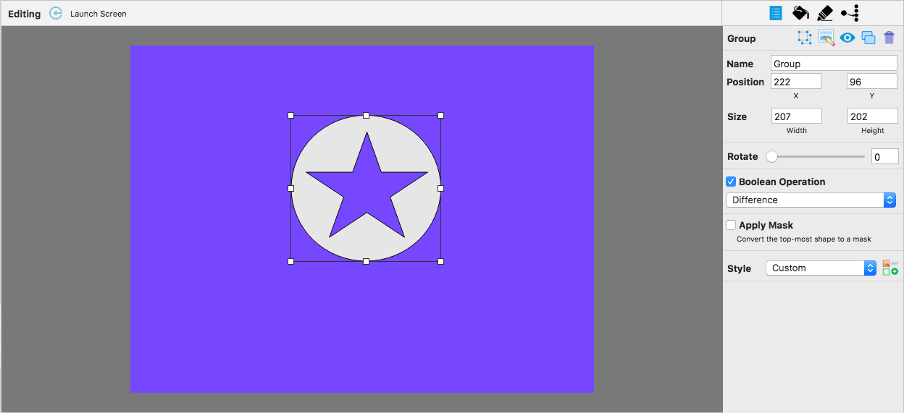
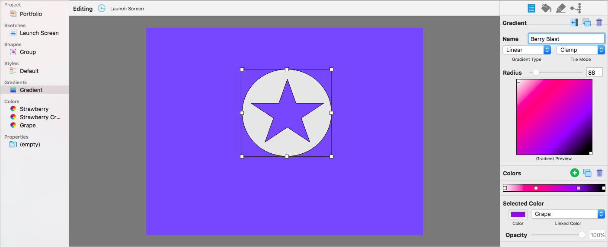
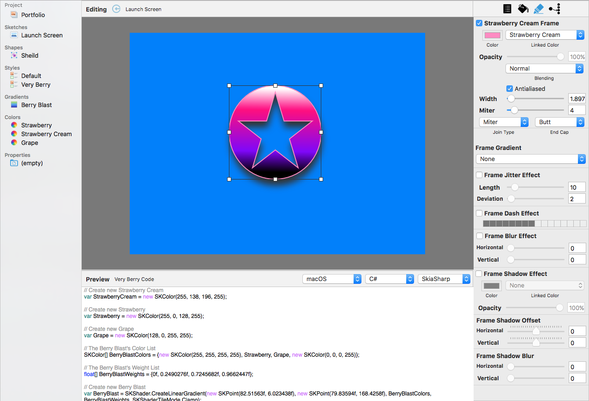
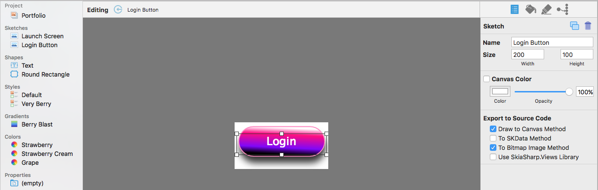
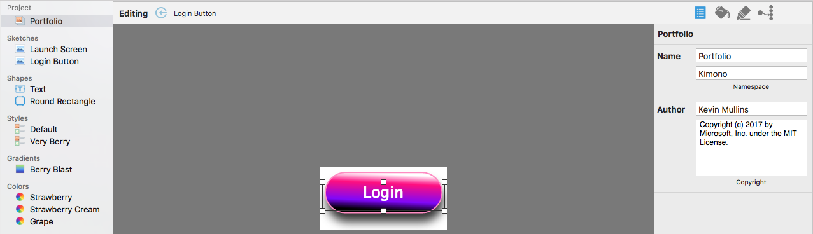
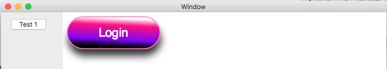
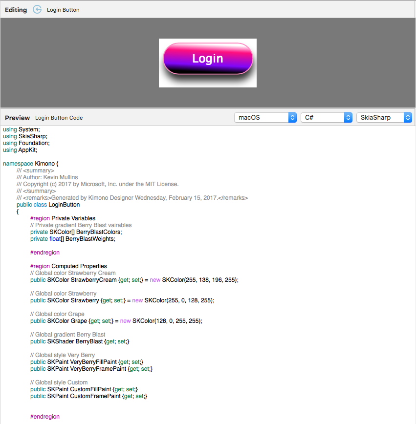
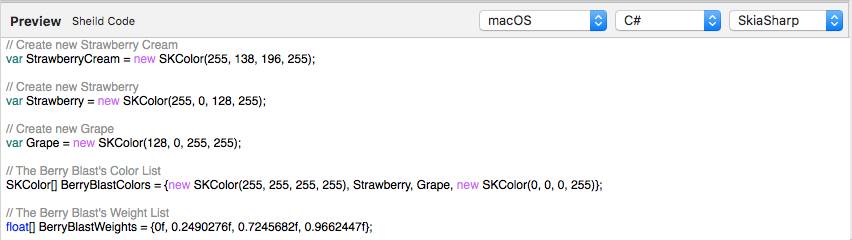
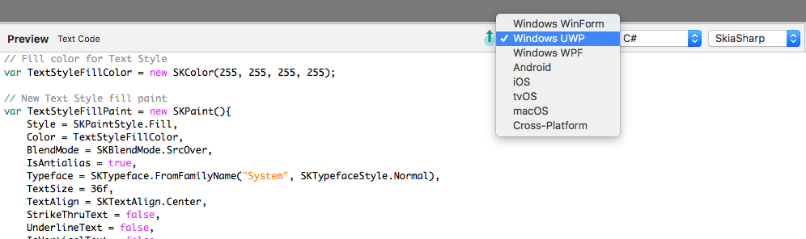
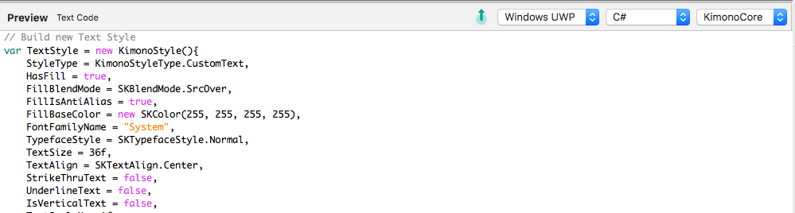

Kimono Designer
============

Kimono Designer allows a developer to graphically edit SkiaSharp based graphic objects that can can be converted to code and included in any cross-platform language and OS that SkiaSharp supports.

## Key Features

Kimono Designer provides several key features that make it the perfect tool for designing SkiaSharp graphics that can be used in all of your cross-platform applications.

### Groups with Boolean Operations and Masks

Multiple shapes can be grouped together and features such as boolean operations and masks can be applied to the items in the group. When applying a mask, the top-most item in the group will be used as the masking path:

### Named Palette Colors

A series of named colors can be defined and used in gradients, named styles, by shapes directly or as the basis of other named colors. If a named color is adjusted, everything using the named color will be updated to reflect the new value:

### Visual Gradient Editor

Build named gradients that can be used in named styles or in shapes directly using the built-in gradient editor. Any changes to a gradient will instantly be reflected in the sketch:

### Named Styles

A series of named styles can be created and applied to several shapes in any sketch in a portfolio to provide a uniform look. Any change in a named style will instantly be reflected in the sketch:

### Multiple Sketches within a Portfolio

Multiple sketches can be created inside the same portfolio and all of the named colors, gradients and named styles can be applied across sketches. Additionally, the user has control over how an individual sketch will be exported to source code:

### Portfolios

Portfolios can contain multiple named colors, gradients, styles and sketches that can be exported to source code as a single class:

When this class is included in a cross-platform application, the developer can use its properties and methods to adjust graphics properties and draw the individual sketches:

## Source Code Generation

The main purpose of the Kimono Designer is to allow the developer to graphically define SkiaSharp objects that will be converted to source code that can be used in any cross-platform application that supports SkiaSharp.

As the sketch is designed and edited on the Kimono Designer design surface, source code will be generated for the requested operating system, language and support library in the code preview area:

### Code Snippets

Based on what is selected, code snippets will be generated for individual colors, gradients, styles, shapes and shape groups. These snippets can be copied from the preview area and pasted into Visual Studio projects:

### Generate Code for Multiple Platforms

Source code can be generated for multiple OS platforms with support for Xamarin.Forms (cross-platform) and SkiaSharp.Views:

### Use KimonoCore Support Library

Source code can either be generated directly using SkiaSharp classes or by using the KimonoCore helper classes, which produces smaller source code files and provides several useful features:

When using the helper classes, the developer will need to include the KimonoCore library in any project that consumes the code.

## Work in Progress

This app is very much a work-in-progress and still has several rough areas and missing features (such as drag to select and save/load portfolios). Work is currently focusing on adding the main features of the app, so several UI refinements still need to be implemented.

As a result, it is quite easy to make the running app crash. For example, shift-drag and deleting all of the sketches from a Portfolio. Other features are "broadly" implemented and will behave oddly based on what the user does while running the app. For example, setting names to "" (empty string) or given **Colors** or **Gradients** the same, non-unique name.

These known issues will all be solved in the finished apps (editors are planned on all Xamarin/Windows platforms). For now the app is definitely use at your own risk!

## About this Project

Kimono Designer and the KimonoCore libraries were created by Kevin Mullins for Microsoft, Inc.

The code has been fully commented and, where available, links have be provided from key technologies or methods to relevant information in the [Xamarin.Mac Guides Documentation](https://developer.xamarin.com/guides/#mac).

### API Documentation

Full API documentation is provided via a **ReadMe** file in project folder for each Visual Studio project that makes up the Kimono Designer solution.

## Icon Resources

All of the icons were provided by [Icons8](https://icons8.com). The icons are free for personal use and also free for commercial use, but they require [linking](https://icons8.com/license/) to to their web site. They distribute them under the license called [Creative Commons Attribution-NoDerivs 3.0 Unported](https://creativecommons.org/licenses/by-nd/3.0/). Alternatively, you can [buy a license](https://icons8.com/paid-license-99/) that doesn't require any linking.

# License

**The MIT License (MIT) 
Copyright (c) 2017 Microsoft, Inc.**

Permission is hereby granted, free of charge, to any person obtaining a 
copy of this software and associated documentation files (the "Software"), 
to deal in the Software without restriction, including without limitation 
the rights to use, copy, modify, merge, publish, distribute, sublicense, 
and/or sell copies of the Software, and to permit persons to whom the 
Software is furnished to do so, subject to the following conditions:

The above copyright notice and this permission notice shall be included 
in all copies or substantial portions of the Software.

THE SOFTWARE IS PROVIDED "AS IS", WITHOUT WARRANTY OF ANY KIND, EXPRESS 
OR IMPLIED, INCLUDING BUT NOT LIMITED TO THE WARRANTIES OF MERCHANTABILITY, 
FITNESS FOR A PARTICULAR PURPOSE AND NONINFRINGEMENT. IN NO EVENT SHALL 
THE AUTHORS OR COPYRIGHT HOLDERS BE LIABLE FOR ANY CLAIM, DAMAGES OR 
OTHER LIABILITY, WHETHER IN AN ACTION OF CONTRACT, TORT OR OTHERWISE, 
ARISING FROM, OUT OF OR IN CONNECTION WITH THE SOFTWARE OR THE USE OR 
OTHER DEALINGS IN THE SOFTWARE.