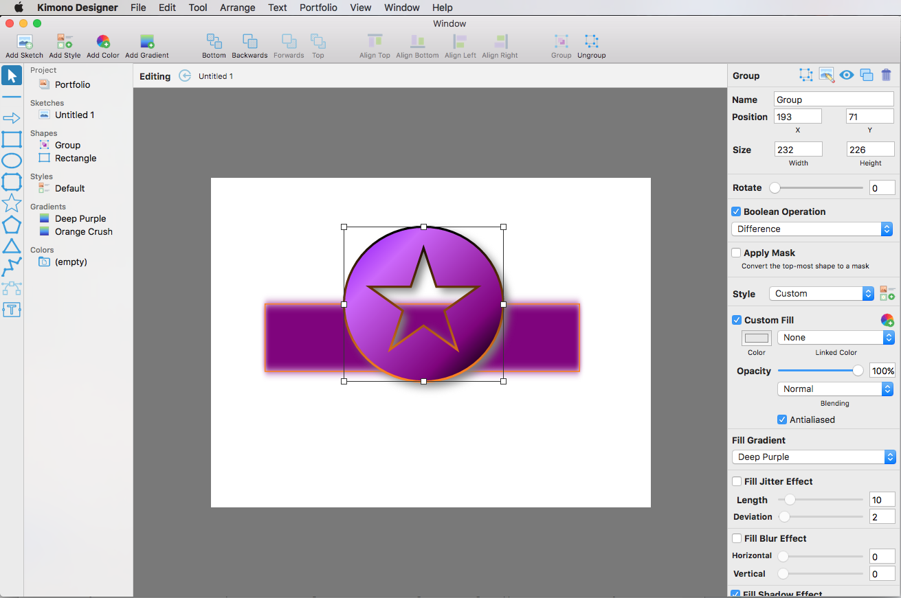

Kimono Designer
============

Kimono Designer allows a developer to graphically edit Skia based graphic objects that can can be converted to code and included in any cross-platform language and OS that SkiaSharp supports.

## Work in Progress

This app is very much a work-in-progress and still has several rough areas and missing features (such as drag to select and save/load portfolios). Work is currently focusing on adding the main features of the app, so several UI refinements still need to be implemented.

As a result, it is quite easy to make the running app crash. For example, shift-drag and deleting all of the sketches from a Portfolio. Other features are "broadly" implemented and will behave oddly based on what the user does while running the app. For example, setting names to "" (empty string) or given **Colors** or **Gradients** the same, non-unique name.

This known issues will all be solved in the finished apps (editors are planned on all Xamarin/Windows platforms). For now the app is definitely use at your own risk!

## About this Project

The code has been fully commented and, where available, links have be provided from key technologies or methods to relevant information in the [Xamarin.Mac Guides Documentation](https://developer.xamarin.com/guides/#mac).

The **APIDocs** folder include full API documentation for the different parts of the Kimono Designer.

## Icon Resources

All of the icons were provided by [Icons8](https://icons8.com). The icons are free for personal use and also free for commercial use, but they require [linking](https://icons8.com/license/) to to their web site. They distribute them under the license called [Creative Commons Attribution-NoDerivs 3.0 Unported](https://creativecommons.org/licenses/by-nd/3.0/). Alternatively, you can [buy a license](https://icons8.com/paid-license-99/) that doesn't require any linking.

# License

**The MIT License (MIT) 
Copyright (c) 2017 Microsoft, Inc.**

Permission is hereby granted, free of charge, to any person obtaining a 
copy of this software and associated documentation files (the "Software"), 
to deal in the Software without restriction, including without limitation 
the rights to use, copy, modify, merge, publish, distribute, sublicense, 
and/or sell copies of the Software, and to permit persons to whom the 
Software is furnished to do so, subject to the following conditions:

The above copyright notice and this permission notice shall be included 
in all copies or substantial portions of the Software.

THE SOFTWARE IS PROVIDED "AS IS", WITHOUT WARRANTY OF ANY KIND, EXPRESS 
OR IMPLIED, INCLUDING BUT NOT LIMITED TO THE WARRANTIES OF MERCHANTABILITY, 
FITNESS FOR A PARTICULAR PURPOSE AND NONINFRINGEMENT. IN NO EVENT SHALL 
THE AUTHORS OR COPYRIGHT HOLDERS BE LIABLE FOR ANY CLAIM, DAMAGES OR 
OTHER LIABILITY, WHETHER IN AN ACTION OF CONTRACT, TORT OR OTHERWISE, 
ARISING FROM, OUT OF OR IN CONNECTION WITH THE SOFTWARE OR THE USE OR 
OTHER DEALINGS IN THE SOFTWARE.